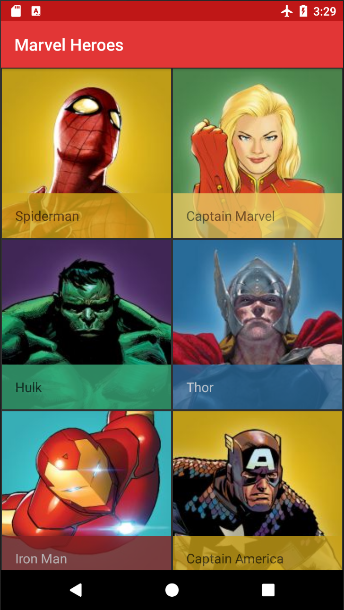
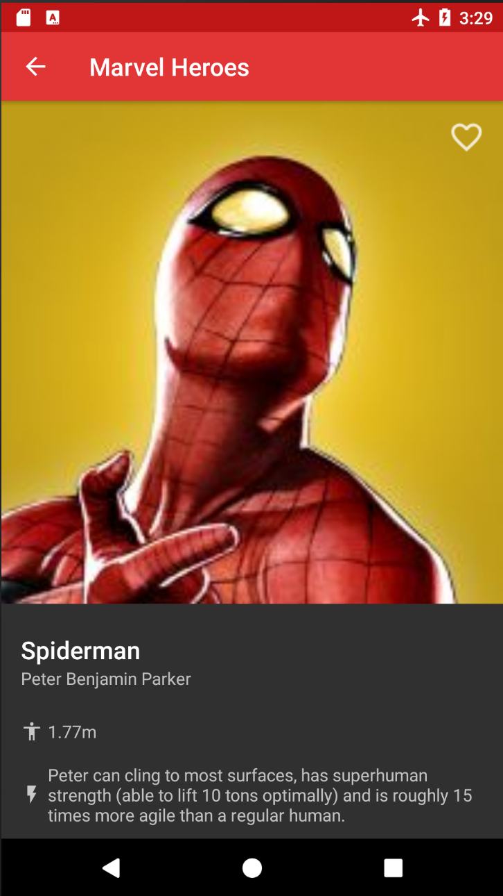
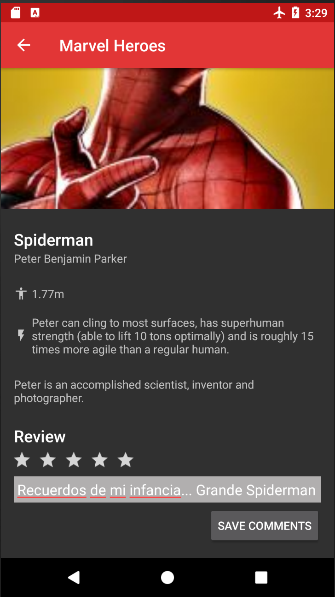

# Marvel Heroes 💪🏻

Marvel Heroes es una app para Android que lista algunos de los súperheroes de Marvel con sus características.

 Main                      |  Detail 1                 |  Detail 2                
:-------------------------:|:-------------------------:|:-------------------------:
 |  | 

## Características ✨

- Kotlin
- MVVM con LiveData
- Dagger2
- RxJava2
- Room

## Notas 📝

- Adaptado a arquitectura MVVM

- Añadida persistencia local mediante Room

- Añadida funcionalidad para marcar / desmarcar los héroes como favoritos, manteniendo la persistencia en local

- Añadida funcionalidad de Reviews para agregar una nota al Héroe así como comentarios de la valoración, persistiendo la información en local.

